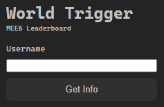
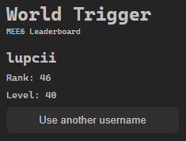

# Get Mee6 Leaderboard Info

Chrome extension to find your own Mee6 leaderboard info.

## Helping

If you want to help, you can:

- [x] Add a new form entry to the popup.html file
  - Server Name
  - Server ID
  - A toggle between each of the above
- [x] Fix Rank problem in the first 3 places on the leaderboard
- [ ] Make offscreen document work so the extension does not have to open a new tab
- [x] Update background.js to take from the form ONE OF
  - Server ID
  - Server Name
- [ ] Add a lifetime (cache) for the data for each server for 12 hours
- [ ] Make the code cleaner
- [ ] Fix partial usernames mapping to full usernames
- [ ] Add support for ranks 100+
- [ ] Add percentage of current level, e.g. 'Level: 23 (79%)'
- [ ] Make the README cuter (e.g. creating a UX flow with screenshots)
